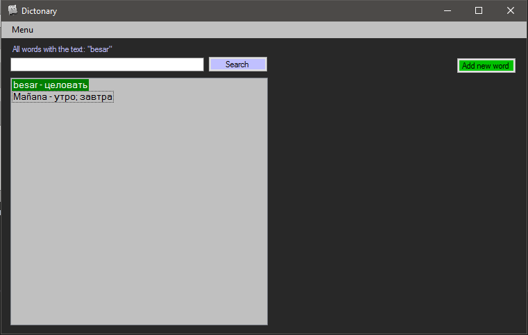

***


---

## About the project:

_DictonaryXML - It's a simple dictionary supporting Spanish, English, Russian._

---

## Why the application was created:

_This project was created to study XML. I decided to arrange a challenge for myself and did not use the database, but instead, the storage of words will be in format xml_

---

## How to start:

#### 1 Run the application
#### 2 Close the application
#### 3 Go to DictonaryXML.UI / bin / debug /
#### 4 In the Words.xml file, paste this text:

``` XML
<?xml version="1.0"?>
<Words>
  <WordsList>
    <Word>
      <MainWord>MainWord</MainWord>
      <TranslationWord>TranslationWord</TranslationWord>
      <PartOfSpeech>0</PartOfSpeech>
      <Gender>0</Gender>
      <Description>Description</Description>
    </Word>
  </WordsList>
</Words>
```
### ! Important note do not leave the dictionary empty, if you left it empty repeat this scheme again !

---

## Acknowledgments:

_I would like to say a special thank you to Ulyanov Ivan, he helped me make functionality that I would not have done._
https://github.com/Ulyanov-programmer

---

## Functional:

- Add
- Edit
- Delete
- Search


___